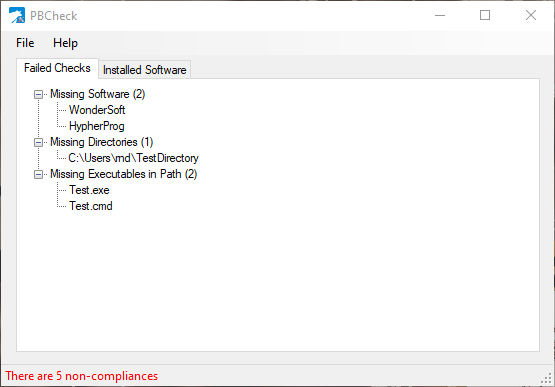

<a href="https://www.bernardi.cloud/">
    
</a>

# PBCheck
> A tool to check for missing software, directories and executables in the PATH

[](https://dotnet.microsoft.com/)
[](https://opensource.org/licenses/GPL-3.0)
[](https://github.com/bernarpa/pdfjuggler/issues)

## Table of contents

- [What is PBCheck](#what-is-pbcheck)
- [What does it look like](#what-does-it-look-like)
- [How is it configured](#how-is-it-configured)
- [License](#license)

## What is PBCheck

PBCheck is a Windows tool that checks for:

- missing programs that should be installed;
- missing directories (I use it to remember to check out my git repositories);
- missing executables in the PATH.

## What does it look like

Nothing fancy:



## How is it configured

Create a JSON file with a content similar to the following:

```json
{
	"DesiredSoftware": [
		"Anaconda3",
		"AutoHotkey",
		"calibre"
	],
	"DesiredDirectories": [
		"C:\\A\\Directory",
		"$HOME\\Some\\Other\\Dir"
	],
	"DesiredExeInPath": [
		"magick.exe",
		"mvn.cmd",
		"test.bat",
		"Flatten-Directory.ps1"
	]
}
```

PBCheck will ask you to locate a configuration file when executed for the first time.

As for the file content, please bear in mind that:

- the entries in the `DesiredSoftware` section are the **prefix** of the desired installed programs (you may check the convenient `Installed Software` tab to get a list of installed software names);
- the entries in the `DesiredDirectories` section can have the `$HOME` prefix, which will be automatically replaced with the user's home directory (e.g. `C:\Users\MyUser`);
- the entries in the `DesiredExeInPath` can be any kind of executable file, including `.exe`, `.cmd`, `.bat` and `.ps1`.

# License

PBCheck is licensed under the terms of the GNU General Public License version 3.
